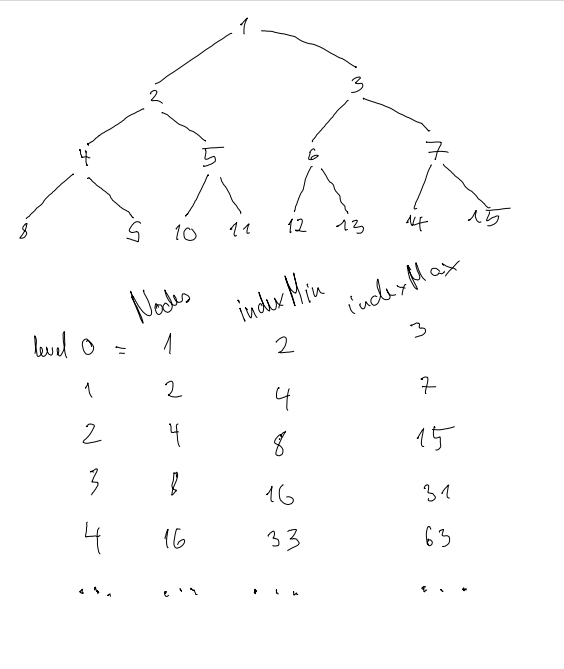

# HEAPS

# THEORY

+ [Video explanation of HEAP Watch Until 3. minute, ](https://www.youtube.com/watch?v=t0Cq6tVNRBA)
+ [Written explanation of HEAP + implementation in Python](https://www.askpython.com/python/examples/min-heap)

## COMPLEXITY

+ Removing operation O(log n)
+ Adding operation O(log n)

## MOVEMENT

+ left child = 2 * parent_idx 
+ right child = 2 * parent_idx + 1
+ parent_idx = child_idx // 2  # for 4,5 this is 2 , for 6,7 this is 3 

# PROBLEMS

## PROBLEM https://leetcode.com/problems/kth-largest-element-in-an-array/

I need to hold only the K largest elements in this datastructure. 

1. Create maxHeap 
2. Add all elements 
3. Retrieve k elements 

Complexity of this this is n log n

https://www.interviewbit.com/blog/kth-largest-element-of-array/